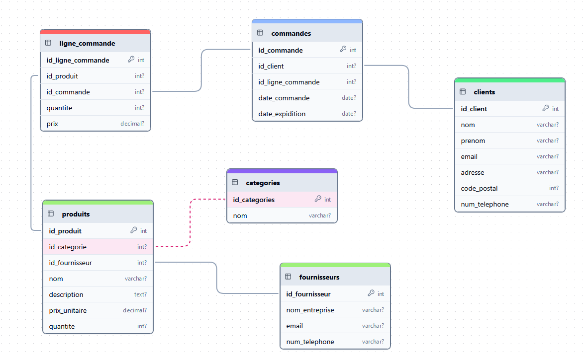

# vun

Premiere version du projet

### Tables des matieres 

- [Lancement du POC](#lancement-du-projet-)  
- [Listes des endpoints](#liste-des-endpoints-)  
- [Diagramme MLD](#diagramme-mld-base-de-donnees)
- [Pistes d'amelioration](#pistes-damelioration-pour-la-v2)

--- 

### Lancement du projet 

#### Recuperation du projet 
````shell
git clone https://github.com/ghmars7/vun.git 
````
#### Lancement 
````shell
cd vun 
````
````shell
npm install 
````
````shell
node server.js 
````

--- 

### Liste des endpoints 


#### **Création d'un Client**
- **URL** : `http://localhost:3000/clients`
- **Méthode** : `POST`
- **Description** : Ajoute un nouveau client à la base de données.
- **Corps de la requête** :
  ```json
  {
      "nom": "Dupont",
      "prenom": "Jean",
      "email": "jean.dupont@example.com",
      "adresse": "12 Rue des Fleurs, Paris",
      "code_postal": 75012,
      "num_telephone": "0601020304"
  }
  ```
- **Exemple de réponse** :
  ```json
  {
      "message": "Client ajouté avec succès."
  }
  ```
#### **Récupération de Tous les Clients**
- **URL** : `http://localhost:3000/clients`
- **Méthode** : `GET`
- **Description** : Récupère la liste de tous les clients.
- **Exemple de réponse** :
  ```json
  [
      {
          "id_client": 1,
          "nom": "Dupont",
          "prenom": "Jean",
          "email": "jean.dupont@example.com",
          "adresse": "12 Rue des Fleurs, Paris",
          "code_postal": 75012,
          "num_telephone": "0601020304"
      },
      {
          "id_client": 2,
          "nom": "Martin",
          "prenom": "Sophie",
          "email": "sophie.martin@example.com",
          "adresse": "5 Avenue du Soleil, Lyon",
          "code_postal": 69003,
          "num_telephone": "0611121314"
      }
  ]
  ```

#### **Récupération d'un Client par ID**
- **URL** : `http://localhost:3000/clients/:id_client`
- **Méthode** : `GET`
- **Description** : Récupère les détails d'un client spécifique.
- **Exemple de réponse** :
  ```json
  {
      "id_client": 1,
      "nom": "Dupont",
      "prenom": "Jean",
      "email": "jean.dupont@example.com",
      "adresse": "12 Rue des Fleurs, Paris",
      "code_postal": 75012,
      "num_telephone": "0601020304"
  }
  ```
- **Exemple de réponse en cas d'erreur (404 Not Found)** :
  ```json
  {
      "message": "Client non trouvé."
  }
  ```

#### **Mise à Jour d'un Client**
- **URL** : `http://localhost:3000/clients/:id_client`
- **Méthode** : `PUT`
- **Description** : Met à jour les informations d'un client existant.
- **Corps de la requête** :
  ```json
  {
      "nom": "Dupont",
      "prenom": "Jean",
      "email": "jean.dupont.updated@example.com",
      "adresse": "12 Rue des Fleurs, Paris",
      "code_postal": 75012,
      "num_telephone": "0601020304"
  }
  ```
- **Exemple de réponse** :
  ```json
  {
      "message": "Client mis à jour avec succès."
  }
  ```

#### **Suppression d'un Client**
- **URL** : `http://localhost:3000/clients/:id_client`
- **Méthode** : `DELETE`
- **Description** : Supprime un client spécifique.
- **Exemple de réponse** :
  ```json
  {
      "message": "Client supprimé avec succès."
  }
  ```

#### **Création d'une Commande**
- **URL** : `http://localhost:3000/commandes`
- **Méthode** : `POST`
- **Description** : Crée une nouvelle commande avec ses lignes associées.
- **Corps de la requête** :
  ```json
  {
      "id_client": 1,
      "date_commande": "2024-03-01",
      "date_expidition": "2024-03-05",
      "lignes": [
          {
              "id_produit": 1,
              "quantite": 10
          },
          {
              "id_produit": 2,
              "quantite": 5
          }
      ]
  }
  ```
- **Exemple de réponse** :
  ```json
  {
      "message": "Commande créée avec succès."
  }
  ```


#### **Récupération de Toutes les Commandes**
- **URL** : `http://localhost:3000/commandes`
- **Méthode** : `GET`
- **Description** : Récupère la liste de toutes les commandes.
- **Exemple de réponse** :
  ```json
  [
      {
          "id_commande": 1,
          "id_client": 1,
          "date_commande": "2024-03-01",
          "date_expidition": "2024-03-05"
      },
      {
          "id_commande": 2,
          "id_client": 2,
          "date_commande": "2024-03-02",
          "date_expidition": "2024-03-06"
      }
  ]
  ```

#### **Récupération d'une Commande par ID**
- **URL** : `http://localhost:3000/commandes/:id_commande`
- **Méthode** : `GET`
- **Description** : Récupère les détails d'une commande spécifique.
- **Exemple de réponse** :
  ```json
  {
      "id_commande": 1,
      "id_client": 1,
      "date_commande": "2024-03-01",
      "date_expidition": "2024-03-05",
      "lignes": [
          {
              "id_ligne_commande": 1,
              "id_produit": 1,
              "quantite": 10,
              "prix": 59.9
          },
          {
              "id_ligne_commande": 2,
              "id_produit": 2,
              "quantite": 5,
              "prix": 62.5
          }
      ]
  }
  ```

#### **Création d'un Produit**
- **URL** : `http://localhost:3000/produits`
- **Méthode** : `POST`
- **Description** : Ajoute un nouveau produit à la base de données.
- **Corps de la requête** :
  ```json
  {
      "id_categorie": 1,
      "nom": "Papier A4 Premium",
      "description": "Papier blanc de haute qualité, grammage 80g/m²",
      "prix_unitaire": 5.99,
      "quantite": 500
  }
  ```
- **Exemple de réponse** :
  ```json
  {
      "message": "Produit ajouté avec succès."
  }
  ```

#### **Récupération de Tous les Produits**
- **URL** : `http://localhost:3000/produits`
- **Méthode** : `GET`
- **Description** : Récupère la liste de tous les produits.
- **Exemple de réponse** :
  ```json
  [
      {
          "id_produit": 1,
          "id_categorie": 1,
          "nom": "Papier A4 Premium",
          "description": "Papier blanc de haute qualité, grammage 80g/m²",
          "prix_unitaire": 5.99,
          "quantite": 500
      },
      {
          "id_produit": 2,
          "id_categorie": 2,
          "nom": "Carton ondulé",
          "description": "Carton résistant pour emballage",
          "prix_unitaire": 12.5,
          "quantite": 200
      }
  ]
  ```


#### **Récupération d'un Produit par ID**
- **URL** : `http://localhost:3000/produits/:id_produit`
- **Méthode** : `GET`
- **Description** : Récupère les détails d'un produit spécifique.
- **Exemple de réponse** :
  ```json
  {
      "id_produit": 1,
      "id_categorie": 1,
      "nom": "Papier A4 Premium",
      "description": "Papier blanc de haute qualité, grammage 80g/m²",
      "prix_unitaire": 5.99,
      "quantite": 500
  }
  ```


### Diagramme MLD Base de donnees


 
---

### Pistes d'amelioration pour la V2

- utilisation du mot de passe en clair de la bdd dans le fichier server.js.
- utilisation du compte root pour acceder a la base de donner.
- utilisation directe de requete vers la base de donnee rend le code plus fragile face aux erreurs.
- Absence de validation des entrées utilisateur avant interaction avec la base de données ce qui peut entraîner des injections SQL.
- Manque de gestion des transactions lors des insertions dans plusieurs tables, ce qui peut laisser la base de données avec des tables non remplis en cas d'échec. 
- Absence de fermeture des connections a la base de données dans les requêtes SQL

     